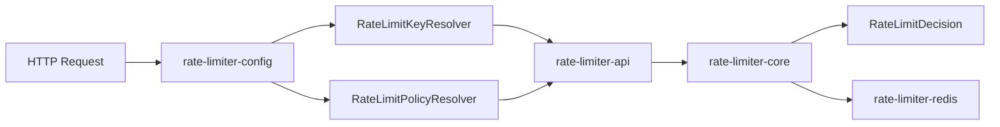

# rate-limiter

[](https://github.com/jho951/rate-limiter/actions/workflows/build.yml)
[](https://github.com/jho951/rate-limiter/actions/workflows/publish.yml)
[](https://central.sonatype.com/search?q=io.github.jho951)
[](./LICENSE)
[](https://github.com/jho951/rate-limiter/tags)

이 저장소는 HTTP 요청의 빈도를 제한하는 재사용 가능한 OSS rate limiter 레이어입니다.

- IP, 사용자 ID, API Key 기준으로 요청 주체를 구분
- Token Bucket 기반으로 허용 / 차단을 판정
- `429` 응답과 `Retry-After` 헤더를 위한 최소 계약을 제공
- Spring Boot 어댑터와 Redis 분산 저장 구현을 모듈별로 분리

## 30초 요약

```gradle
repositories {
    mavenCentral()
}

dependencies {
    implementation("io.github.jho951:rate-limiter-config:1.0.0")
}
```

```java
RateLimiter limiter = new TokenBucketRateLimiter();
RateLimitDecision decision = limiter.tryAcquire(
    RateLimitKey.of(RateLimitKeyType.IP, "1.2.3.4"),
    1,
    RateLimitPlan.perSecond(10, 1.0)
);
```



현재 릴리스 기준 버전은 `1.0.0`입니다.

## 목표

- 인증이나 비즈니스 로직과 분리된 rate limiting 계층 제공
- Spring Boot 애플리케이션에서 바로 붙일 수 있는 기본 어댑터 제공
- 단일 인스턴스와 Redis 분산 환경을 같은 계약으로 다룰 수 있게 구성
- 서비스별 정책은 애플리케이션이 주입하고, 공통 책임만 이 저장소가 담당

## 프로젝트 구조

```text
├─ rate-limiter-api
├─ rate-limiter-core
├─ rate-limiter-config
├─ rate-limiter-redis
└─ docs
```

## 문서

- 아키텍처: [docs/architecture.md](./docs/architecture.md)
- 예제: [docs/examples.md](./docs/examples.md)
- 버전 정책: [docs/versioning-roadmap.md](./docs/versioning-roadmap.md)
- API 모듈: [docs/modules/api.md](./docs/modules/api.md)
- Core 모듈: [docs/modules/core.md](./docs/modules/core.md)
- Config 모듈: [docs/modules/config.md](./docs/modules/config.md)
- Redis 모듈: [docs/modules/redis.md](./docs/modules/redis.md)

## 모듈

| Module | 설명 |
| --- | --- |
| `rate-limiter-api` | `RateLimitKey`, `RateLimitPlan`, `RateLimitDecision`, `RateLimiter` 같은 공개 계약만 제공합니다. |
| `rate-limiter-core` | Token Bucket 판정 엔진과 in-memory store를 제공합니다. |
| `rate-limiter-config` | Spring Boot AutoConfiguration, HTTP filter, properties, key/policy resolver를 제공합니다. |
| `rate-limiter-redis` | Redis 기반 분산 저장 구현과 AutoConfiguration을 제공합니다. |

## 핵심 흐름

1. HTTP 요청이 `rate-limiter-config`로 들어옵니다.
2. `RateLimitKeyResolver`가 `RateLimitKey`를 만듭니다.
3. `RateLimitPolicyResolver`가 `RateLimitPlan`을 결정합니다.
4. `rate-limiter-core` 또는 `rate-limiter-redis`가 `tryAcquire(...)`를 수행합니다.
5. 결과를 `RateLimitDecision`으로 반환합니다.
6. 차단 시 `429`와 `Retry-After`를 내려줍니다.

## 빠른 시작

### 1. Spring Boot에서 사용

```gradle
repositories {
    mavenCentral()
}

dependencies {
    implementation("io.github.jho951:rate-limiter-config:1.0.0")
}
```

```yml
ratelimiter:
  enabled: true
  mode: memory
  trust-forward-headers: false
  fail-open: false
  header:
    api-key-header: X-API-Key
    user-id-header: X-User-Id
  ip:
    capacity: 60
    refill-per-second: 60
  user-id:
    capacity: 120
    refill-per-second: 120
  api-key:
    capacity: 300
    refill-per-second: 300
```

### 2. 순수 Java에서 사용

```java
RateLimiter limiter = new TokenBucketRateLimiter();
RateLimitDecision decision = limiter.tryAcquire(
    RateLimitKey.of(RateLimitKeyType.USER_ID, "user-123"),
    1,
    RateLimitPlan.perSecond(100, 50.0)
);

if (!decision.isAllowed()) {
    System.out.println("retry after = " + decision.getRetryAfterMillis() + "ms");
}
```

### 3. Redis 분산 모드

`rate-limiter-redis`를 추가하면 여러 인스턴스가 같은 버킷 상태를 공유할 수 있습니다.

```gradle
dependencies {
    implementation("io.github.jho951:rate-limiter-redis:1.0.0")
}
```

## `rate-limiter-config` 역할

- HTTP 요청 헤더에서 rate limit key를 추출
- 기본 정책을 `RateLimiterProperties`로 바인딩
- `excluded-paths`, `trust-forward-headers`, `fail-open` 지원
- `429` 응답과 `Retry-After` 처리

## GitHub Actions

> 배포(`publish`) 시에만 Central Portal 인증 정보가 필요합니다.

- `MAVEN_CENTRAL_USERNAME`
- `MAVEN_CENTRAL_PASSWORD`
- `MAVEN_CENTRAL_GPG_PRIVATE_KEY`
- `MAVEN_CENTRAL_GPG_PASSPHRASE`
- `MAVEN_CENTRAL_NAMESPACE`

워크플로우 동작은 다음과 같습니다.

- `main` 브랜치로 `push` 하면 `build` 실행
- `main` 대상 `pull_request`가 열리면 `build` 실행
- `v*` 태그가 `push` 되면 `publish` 실행

## Build & Test

```bash
./gradlew clean build
```

## Release Policy

- 버전은 루트 `gradle.properties`의 `version`에서 관리합니다.
- 태그는 `v1.0.0` 형식으로 직접 생성합니다.
- 태그 `push`가 발생하면 `publish.yml`이 실행되어 Maven Central 배포를 시도합니다.

릴리스 절차 예시:

```bash
git add -A
git commit -m "release: v1.0.0"
git tag -a v1.0.0 -m "release: v1.0.0"
git push origin main
git push origin v1.0.0
```

## 무엇이 아닌가

- 서비스별 business quota 엔진
- 인증 서버
- 권한 판단 엔진
- 운영 콘솔
- 멀티테넌트 정책 허브

## License

[Apache License 2.0](./LICENSE)
